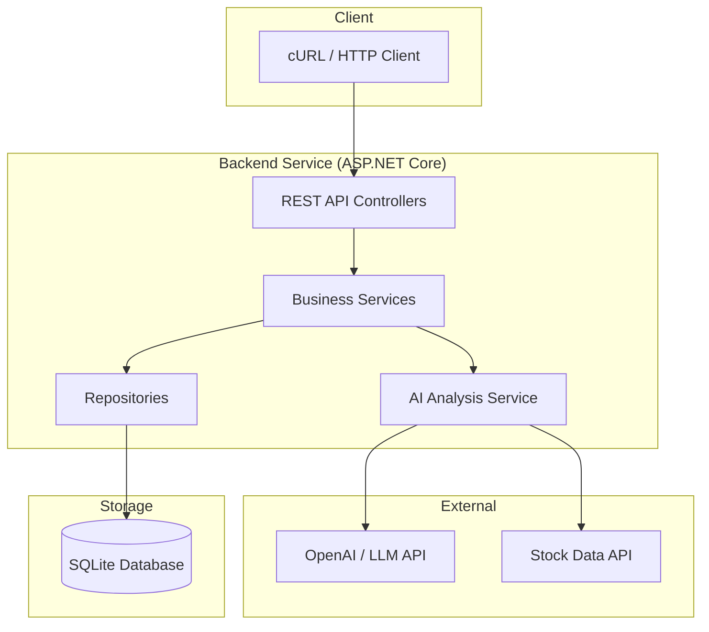
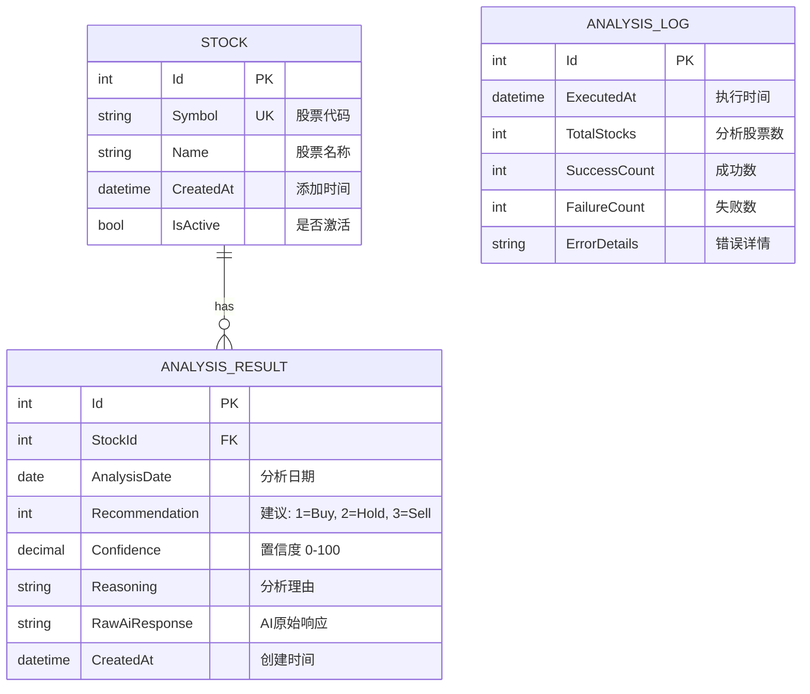
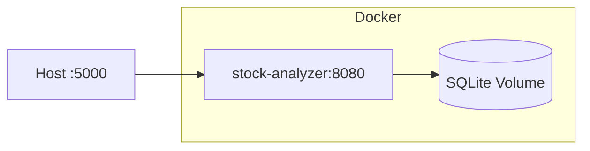

# Stock AI Analyzer - 项目设计文档

## 1. 系统概述

一个基于 C# ASP.NET Core 的股票 AI 分析工具，支持：

- 管理股票观察列表
- 调用 AI 对股票进行分析，给出买入/持有/卖出建议及置信度
- 记录每日分析结果
- 统计分析（如查找连续 N 天买入建议的股票）

## 2. 系统架构



## 3. 分层架构

```
backend/
├── StockAnalyzer.Api/           # API 层 - Controllers, Middleware, Filters
├── StockAnalyzer.Core/          # 核心层 - Services, Interfaces, DTOs, Models
└── StockAnalyzer.Infrastructure/ # 基础设施层 - Repositories, DbContext, External APIs
```

## 4. ER 图



## 5. API 接口清单

### 5.1 股票管理 (StockController)

| Method | Endpoint               | Description        |
| ------ | ---------------------- | ------------------ |
| POST   | `/api/stocks`          | 添加股票到观察列表 |
| GET    | `/api/stocks`          | 获取所有股票列表   |
| GET    | `/api/stocks/{symbol}` | 获取单个股票详情   |
| PUT    | `/api/stocks/{symbol}` | 更新股票信息       |
| DELETE | `/api/stocks/{symbol}` | 从列表删除股票     |
| POST   | `/api/stocks/batch`    | 批量添加股票       |

### 5.2 AI 分析 (AnalysisController)

| Method | Endpoint                         | Description                        |
| ------ | -------------------------------- | ---------------------------------- |
| POST   | `/api/analysis/run`              | 触发 AI 分析（全部或指定股票）     |
| POST   | `/api/analysis/run/{symbol}`     | 分析单个股票                       |
| GET    | `/api/analysis/results`          | 获取分析结果（支持分页和日期筛选） |
| GET    | `/api/analysis/results/{symbol}` | 获取指定股票的分析历史             |
| GET    | `/api/analysis/latest`           | 获取最新一次分析结果               |

### 5.3 统计查询 (StatisticsController)

| Method | Endpoint                         | Description                    |
| ------ | -------------------------------- | ------------------------------ |
| GET    | `/api/statistics/consecutive`    | 查找连续 N 天相同建议的股票    |
| GET    | `/api/statistics/summary`        | 获取统计汇总（按建议类型分组） |
| GET    | `/api/statistics/trend/{symbol}` | 获取单个股票的趋势分析         |

### 5.4 健康检查 (HealthController)

| Method | Endpoint            | Description              |
| ------ | ------------------- | ------------------------ |
| GET    | `/api/health`       | 健康检查                 |
| GET    | `/api/health/ready` | 就绪检查（含数据库连接） |

## 6. 数据模型

### 6.1 Recommendation 枚举

```csharp
public enum Recommendation
{
    Buy = 1,    // 买入
    Hold = 2,   // 持有
    Sell = 3    // 卖出
}
```

### 6.2 请求/响应 DTO

#### AddStockRequest

```json
{
  "symbol": "AAPL",
  "name": "Apple Inc."
}
```

#### RunAnalysisRequest

```json
{
  "symbols": ["AAPL", "GOOGL"], // 可选，为空则分析全部
  "forceRerun": false // 是否强制重新分析今日已分析的
}
```

#### AnalysisResultResponse

```json
{
  "symbol": "AAPL",
  "name": "Apple Inc.",
  "analysisDate": "2026-01-30",
  "recommendation": "Buy",
  "confidence": 85.5,
  "reasoning": "Based on strong Q4 earnings..."
}
```

#### ConsecutiveQueryRequest

```json
{
  "days": 5,
  "recommendation": "Buy" // Buy, Hold, Sell
}
```

## 7. AI 分析 Prompt 设计

```
You are a professional stock analyst. Analyze the following stock and provide investment recommendation for the next month.

Stock: {symbol} - {name}
Current Price: {price}
Recent News: {news_summary}
Technical Indicators: {indicators}

Respond in JSON format:
{
  "recommendation": "Buy|Hold|Sell",
  "confidence": 0-100,
  "reasoning": "Your analysis explanation in 2-3 sentences"
}
```

## 8. 配置项

```json
{
  "AiSettings": {
    "Provider": "OpenAI",
    "ApiKey": "sk-xxx",
    "Model": "gpt-4",
    "MaxTokens": 500,
    "Temperature": 0.3
  },
  "StockDataSettings": {
    "Provider": "AlphaVantage",
    "ApiKey": "xxx"
  },
  "AnalysisSettings": {
    "MaxConcurrentAnalysis": 5,
    "RetryCount": 3,
    "TimeoutSeconds": 30
  }
}
```

## 9. 错误处理

### HTTP 状态码规范

| Code | Scenario                 |
| ---- | ------------------------ |
| 200  | 成功                     |
| 201  | 创建成功                 |
| 400  | 请求参数错误             |
| 404  | 资源不存在               |
| 409  | 资源冲突（如股票已存在） |
| 500  | 服务器内部错误           |
| 503  | AI 服务不可用            |

### 统一错误响应格式

```json
{
  "code": "STOCK_NOT_FOUND",
  "message": "Stock with symbol 'XXX' not found",
  "timestamp": "2026-01-30T10:00:00Z",
  "traceId": "abc123"
}
```

## 10. 日志规范

- 使用 Serilog 结构化日志
- 关键操作必须记录：
  - 股票增删改
  - AI 分析触发与结果
  - 异常和错误
- 日志级别：
  - INFO: 业务操作
  - WARN: 可恢复错误
  - ERROR: 不可恢复错误

## 11. 部署架构


